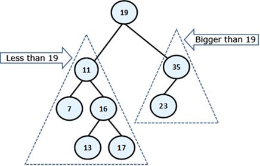

## Introduction
A Binary Search Tree is a tree data structure, that consists of collection of nodes. Within a binary search tree, a node that has a child or children nodes is referred to as a parent node, and the child of a node is referred to as a child node.
Each parent node has at most 2 children nodes, which are called its left and right child. The first element inserted into a binary search tree is referred to as the root of the tree. 
A binary search tree is an ordered data structure and it is arranged in such a way that the nodes placed on the left side of the root are smaller than the root and nodes placed on the right side of the root are bigger than the root.
A childless node is called a leaf.



From the above image, we can conclude that a binary search tree is a recursive data structure, in the sense that, the left child is always smaller than its parent and the right child is always bigger than its parent.
Binary Search Trees are used in the real world, in game development and also in compilers.


 
The above image is still as a binary search tree, and it is called a skewed binary search tree, it is the worst case scenario for a binary search tree


Some operations we can perform on a graph include:
* `Insert(T value)` - insert node with the specified value
* `Find(T value)` - finds node with specified value within the tree
* `Remove(T value)` - removes a node with the specified value in the tree

## Internals : Representation of Binary Search Tree
In a binary search tree each node is represented using the folowing parts
1. Data, this is usually wrapped within a node
2. Pointer to left child
3. Pointer to right child


#### Operations
1. **`Insert(T value)`**
    ```
    Pseudocode:
    * Checks if the tree is empty
    * If it is, 
	- create a node, and wrap the node around the value, set the parent pointer to null and the node becomes the root.
    * If it is not 
        - compare the value to the value of the root node.
    * If it is lesser than the root 
        - then recursively compare the value to the values of the nodes at the left side of the root, when a suitable position is found then create a new node
    * If it is greater than the root 
        - then recursively compare the value to the values of the nodes at the right side of the root, when a suitable position is found then create a new node
    ```
    **Time Complexity**: Time to compare value to the value of the root + Time to compare values with values within the tree + Time to create new node
    | Time to compare value to the value of the root   | Time to compare value with values within tree |Time to create new node  | Worst Case for `hasVertex(vertex)` |
    |--------------------------------------------------|-----------------------------------------------|-------------------------|------------------------------------|
    | Constant Time / O(1)                             | Linear Time / O(N)                            | Constant time O(1)      | Linear time O(N)		      |

    
2. **`Find(T value)`**
    ```
    Pseudocode:
    * Check if the tree is empty
    * If it is
	- return an exception
    * If it is not
       - compare the value you searching for with the value of the root node
    * If the value is equal to the root return the root node
    * If the value is less than the value of the root, search for the value at left side of the root
    * If the value is greater than the value of the root, search for the value at right side of the root
    ```

    **Time Complexity**: Time to check if tree is empty + Time to compare the value with value of the root + Time to compare value with values within tree.
    | Time to check if tree is empty | Time to check if value is same as root |	Time to compare value with values within tree  | Worst Case for `Find(T value)` |
    |--------------------------------|----------------------------------------|------------------------------------------------|--------------------------------|
    | Constant Time / O(1)           | Constant Time / O(1)                   | Linear Time O(N)                               |  Linear Time O(N)              |

    
3. **`Remove(T value)`**
    ```
    Pseudocode:
    * Search if node exists within tree
    * If node does not exist
    	- throw an exception
    * If node exists
    * Is the node childless, 
	- set node to null
    * Node has a single child, 
	- replace node with child
    * Node has two children, 
        - find the leftmost/minimum value in the right child replace it with node, 
	- then go ahead and remove duplicated node in the right sub tree using the two steps described above
    ```

    **Time Complexity**: Time to check if node exists in tree + Time taken to search for replacement node in the right subtree + Time taken to remove node reference.
    | Time to check if node exists in tree  | Time taken to search for replacement node in the right subtree | Time taken to remove node reference  | Worst Case for `Remove(T value)` |
    |---------------------------------------|----------------------------------------------------------------|--------------------------------------|----------------------------------|
    | Linear Time / O(N)                    | Linear Time / O(h)                                             | Constant Time O(1)                   |  Linear Time O(N)                |


## Terminologies
1. **Root**: The topmost node in the tree is called the root.
2. **Skewed Binary Tree**: In a skewed binary tree all nodes except one have only one child node
3. **Recursive Data Structure**: A data structure that is partially composed of smaller or simpler instances of the same data structure

## References
1. [Delete Node from binary search tree](https://guides.codepath.com/compsci/Delete-Node-From-Binary-Search-Tree)
2. [Binary Search Trees](https://www.freecodecamp.org/news/binary-search-trees-bst-explained-with-examples/)
3. [Binary Search Tree and real world applications](https://dev.to/phuctm97/2-min-codecamp-binary-search-tree-and-real-world-applications-58cj)
4. [Complexity of inserting N numbers into a binary search tree](https://www.baeldung.com/cs/inserting-complexity-binary-search-tree)
5. [Gate | Gate-CS-2015 | Question 33](https://www.geeksforgeeks.org/gate-gate-cs-2015-set-1-question-33/)
