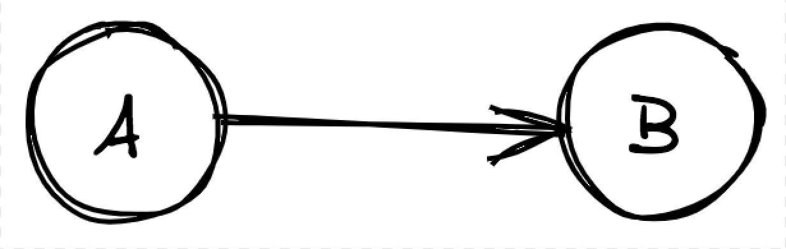
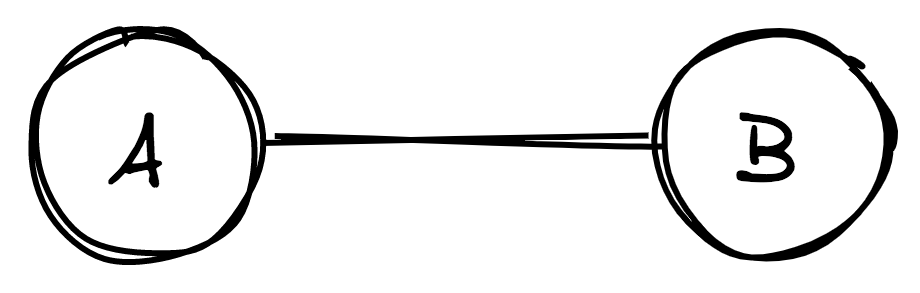
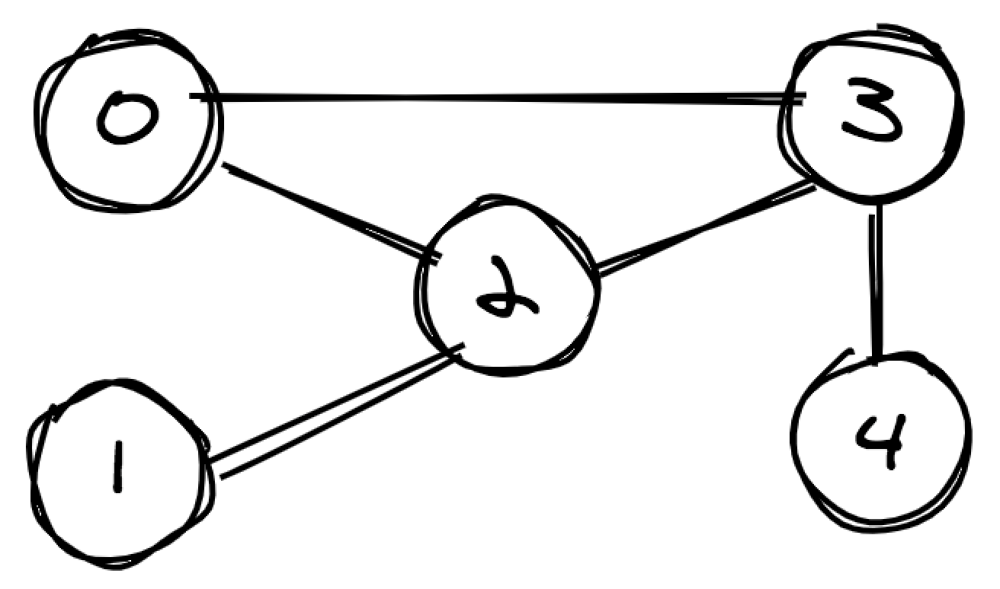
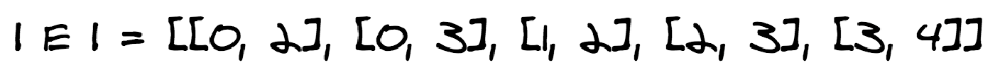
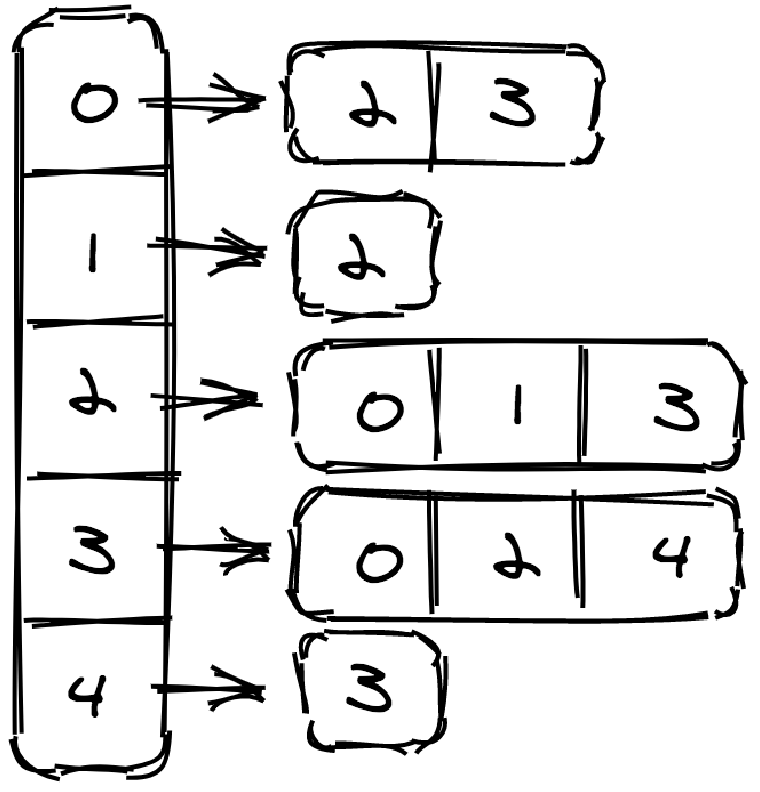

## Introduction
A graph is a non-linear data structure that consists of vertices and edges that link these vertices. A graph can be represented by the symbol **G(V,E)**, where V = vertices and E = edges. We denote an edge connecting vertices u and v by the pair **(u,v)**<sup>[4](https://github.com/oyekanmiayo/data-structures-all-langs/tree/main/graph#references)</sup>.

Graphs are used to solve real-world problems that involve the representation of the problem space as a network e.g. telephone network, social networks, neural networks and so on. In the case of a social network, users can be represented as vertices (or nodes) and friendship between users can be represented using edges. You can generalize this example to the other problems that a graph can model.

There are two types of graphs: **Directed** and **Undirected**.

### Directed Graphs
In a directed graph, nodes are connected by directed edges – they only go in one direction. For example, in the image below, an edge connects node A and B, but the arrow head points towards B, so, we can only traverse from node A to node B – not in the opposite direction<sup>[1](https://github.com/oyekanmiayo/data-structures-all-langs/tree/main/graph#references)</sup>. 



### Undirected Graphs
In an undirected graph the edges are bidirectional, with no direction associated with them. Hence, the graph can be traversed in either direction. For example, in the image below, the graph can be traversed from node A to node B as well as from node B to node A<sup>[1](https://github.com/oyekanmiayo/data-structures-all-langs/tree/main/graph#references)</sup>.



The rest of this README and the implementations for graphs in this repo assumes we are using an undirected graphs. This will be true except otherwise stated.

Some operations we can perform on a graph include:
* `addVertex(vertex)`
* `hasVertex(vertex)`
* `addEdge(vertex1, vertex2)`
* `hasEdge(vertex1, vertex2)`
* `findNeighbours(vertex)`

## Internals : Representation of Graphs
There are several ways to represent graphs, each with its advantages and disadvantages. Some situations or algorithms that we want to run with graphs as input, call for one representation, and others call for a different representation. Graphs are commonly represented in three ways:
1. [Edge List]()
2. [Adjacency Matrix]()
3. [Adjacency List]()

We will use the graph below as an example to explain each representation



### Edge List
One simple way to represent a graph is just a list, or array, of |E| edges, which we call an **edge list**. To represent an edge, we just have an array of two vertex numbers, or an array of objects containing the vertex numbers of the vertices that the edges are incident on<sup>[4](https://github.com/oyekanmiayo/data-structures-all-langs/tree/main/graph#references)</sup>. The image below shows an **edge list** representation of the graph example. 



The amount of space that this graph implementation uses is **O(|E|)**, where |E| = set of edges.

#### Operations
1. **`addVertex(vertex)`**
    ```
    This operation isn't valid for this implementation because it we can only add edges
    ```

2. **`hasVertex(vertex)`**
    ```
    Pseudocode:
    * Traverse the array of edges
        - If either vertex on an edge matches the vertex being sought for, return true
    * Return false if no match is found
    ```
    **Time Complexity**: Linear Time or **O(|E|)**, where **|E|** = array or set of edges
    | Array Traversal        | Worst Case for `hasVertex(vertex)` |
    |------------------------|------------------------------------|
    | Linear Time / O(\|E\|) | Linear Time / O(\|E\|)             |

    **Space  Complexity**: No extra space is used in this method. Constant Space or **O(1)**
    | Worst Case for `hasVertex(vertex)`|
    |-----------------------------------|
    | Constant Space / O(1)             |

3. **`addEdge(vertex1, vertex2)`**
    ```
    Pseudocode:
    * Create a new array containing both vertices
    * Insert new array into 2-D array or list of edges
    ```

    **Time Complexity**: Time to insert array into 2-D array or list. Worst case is Linear Time or **O(|E|)**, where **|E|** = array or set of edges; Amortized time is Constant Time or **O(1)**.
    | Worst Case for `addEdge(vertex1, vertex2)` | Amortized Time for `addEdge(vertex1, vertex2)` |
    |--------------------------------------------|------------------------------------------------|
    | Linear Time / O(\|E\|)                     | Constant Space / O(1)                          |

    **Space  Complexity**: Worst case is if a new underlying array needs to be created because the list is filled. Worst case is Linear Space or **O(|E|)**, where **|E|** = array or set of edges; Amortized Space is Constant Space or **O(1)**.
    | Worst Case for `addEdge(vertex1, vertex2)` | Amortized Space for `addEdge(vertex1, vertex2)` |
    |--------------------------------------------|-------------------------------------------------|
    | Linear Space / O(\|E\|)                    | Constant Space / O(1)                           |

4. **`hasEdge(vertex1, vertex2)`**
    ```
    Pseudocode:
    * Traverese array of edges and compare each one until edge is found
        - if edge is, return true
    * Return false if edge is not found
    ```

    **Time Complexity**: Linear Time or **O(|E|)**, where **|E|** = array or set of edges
    | Array Traversal        | Worst Case for `hasEdge(vertex1, vertex2)` |
    |------------------------|--------------------------------------------|
    | Linear Time / O(\|E\|) | Linear Time / O(\|E\|)                     |

    **Space  Complexity**: No extra space is used in this method. Constant Space or **O(1)**
    | Worst Case for `hasEdge(vertex1, vertex2)` |
    |--------------------------------------------|
    | Constant Space / O(1)                      |

5. **`findNeighbours(vertex)`**
    ```
    Pseudocode:
    * Traverse array of edges
        - If an edge contains a the passed-in vertex, add it to a list
    * Return the list
    ```

    **Time Complexity**: Linear Time or **O(|E|)**, where **|E|** = array or set of edges
    | Array Traversal        | Worst Case for `findNeighbours(vertex)` |
    |------------------------|---------------------------------------------|
    | Linear Time / O(\|E\|) | Linear Time / O(\|E\|)                      |

    **Space  Complexity**: Space used  to store all neighbours. Linear Space or **O(|E|)**, where **|E|** = array or set of edges
    | Array of Neighbours     | Worst Case for `findNeighbours(vertex)` |
    |-------------------------|-----------------------------------------|
    | Linear Space / O(\|E\|) | Linear Space / O(\|E\|)                 |


#### Additional Notes
* To find edge and all the neighbours for an edge in a more efficient manner, we can sort the edge list. The time complexity for  `findEdge(vertex1, vertex2)` and `findNeighbours(vertex)` will reduce  to **O(log|E|)**, where |E| = set of edges

### Adjacency Matrix
For a graph with |V| vertices, an **adjacency matrix** is a |V| × |V| matrix of 0s and 1s, where the entry in row<sub>i</sub> and column<sub>j</sub> is 1 if and only if the **edge (i,j)** is in the graph. The image below shows an **adjacency matrix** representation of the graph example.


The amount of space used for this implementation is **O(|V|<sup>2</sup>)**, where |V| = set of vertices. This implementation uses a lot of space that is especially inefficient if the graph has a small number of edges.

#### Operations
1. **`addVertex(vertex)`**
    ```
    Pseudocode:
    * Add a new row and a new column to the matrix
    * Fill all new empty cells with 0, because new vertex has no edges yet
    ```
2. **`hasVertex(vertex)`**
    ```
    Pseudocode:
    * Check if vertex < matrix's size
        - If true, then vertex exists
        - If false, then vertex does not exist
    ```
3. **`addEdge(vertex1, vertex2)`**
    ```
    Pseudocode:
    * Check vertex1 exists
        - If it doesn't, call addVertex(vertex1)
    * Check vertex2 exists
        - If it doesn't, call addVertex(vertex2)
    * graph[vertex1][vertex2] = 1  
    * graph[vertex2][vertex1] = 1 (This is necessay because the graph is undirected)
    ```
4. **`hasEdge(vertex1, vertex2)`**
    ```
    Pseudocode:
    * Assume the 2-D array shown in the image above is called `graph`
    * Get graph[vertex1][vertex2]
        - Return true if it equals 1
        - Return false otherwise
    ```

    **Time Complexity**: Constant Time or **O(1)**
    | 2-D Array Lookup     | Worst Case for `findEdge(vertex1, vertex2)` |
    |----------------------|---------------------------------------------|
    | Constant Time / O(1) | Constant Time / O(1)                        |

    **Space  Complexity**: No extra space is used in this method. Constant Space or **O(1)**
    | Worst Case for `findEdge(vertex1, vertex2)` |
    |---------------------------------------------|
    | Constant Space / O(1)                       |

5. **`findNeighbours(vertex)`**
    ```
    Pseudocode:
    * Assume the 2-D array shown in the image above is called `graph`
    * Access row associated with vertex by calling graph[vertex]
    * Traverse this row
        - If the value at index is 1, then the index is a valid neighbour. Add to a list
        - If the value at index is 0, ignore it
    * Return list
    ```

    **Time Complexity**: Linear Time or **O(|E|)**, where **|E|** = array or set of edges
    | Array Traversal        | Worst Case for `findNeighbours(vertex)`     |
    |------------------------|---------------------------------------------|
    | Linear Time / O(\|E\|) | Linear Time / O(\|E\|)                      |

    **Space  Complexity**: Space used  to store all neighbours. Linear Space or **O(|E|)**, where **|E|** = array or set of edges
    | Array of Neighbours     | Worst Case for `findNeighbours(vertex)` |
    |-------------------------|-----------------------------------------|
    | Linear Space / O(\|E\|) | Linear Space / O(\|E\|)                 |


### Adjacency List
An **adjacency list** represents a graph as an array of lists. Each **index<sub>i</sub>** in this array represents a **vertex<sub>i</sub>** in the graph. Each **index<sub>i</sub>** contains a **list<sub>i</sub>** that contains all the nodes adjacent to **vertex<sub>i</sub>**. Whew, read that again if you need to (me sef I had to). The image below shows an **adjacency list** representation of the graph example.



The amount of space used for this implementation is **O(|V| + |E|)**, where |V| = set of vertices and |E| = set of edges.

#### Operations
Before we talk go into the detail of operations, let's note some things. It is possible to represent adjancency lists in different ways programmatically:
* We can use a map so that each key-value mapping is a vertex-edges  mapping
* We can use an array, so that each index, representing a vertex, will contain a list of edges

The descriptions below assume we use a map.

1. **`addVertex(vertex)`**
    ```
    Pseudocode:
    * Add vertex as a key in the map
    ```
2. **`hasVertex(vertex)`**

If we assume that `addVertex(vertex)` is only called for vertices that will have neighbours, then we can assume that some vertices will exist in this graph but won't be keys in the map. Therefore, we must search all the neighbours for each vertex that is a key. We can do this using **depth-first search** or **breadth-first search**.
    ```
    Pseudocode:
    ```
3. **`addEdge(vertex1, vertex2)`**
4. **`hasEdge(vertex1, vertex2)`**
    ```
    Pseudocode:
    * Access list of edges associated with vertex1 key
    * Traverse list of edges to look for vertex2
    ```

    **Time Complexity**: Access value associated with vertex1 key + Traverse list of edges. Linear Time or **O(|E|)**, where **|E|** = array or set of edges
    | Access value         | Traverse list of edges  | Worst Case for `findEdge(vertex1, vertex2)` |
    |----------------------|-------------------------|---------------------------------------------|
    | Constant Time / O(1) | Linear Space / O(\|E\|) | Linear Space / O(\|E\|)                     |

    **Space  Complexity**: No extra space is used in this method. Constant Space or **O(1)**
    | Worst Case for `findEdge(vertex1, vertex2)` |
    |---------------------------------------------|
    | Constant Space / O(1)                       |

5. **`findNeighbours(vertex)`**
    ```
    Pseudocode:
    * Return list return by key vertex key from map
    ```

    **Time Complexity**: Access value associated with vertex key
    | Access value         | Worst Case for `findNeighbours(vertex)` |
    |----------------------|-----------------------------------------|
    | Constant Time / O(1) | Constant Time / O(1)                    |

    **Space  Complexity**: No extra space is used in this method. Constant Space or **O(1)**
    | Worst Case for `findNeighbours(vertex)` |
    |-----------------------------------------|
    | Constant Space / O(1)                   |

## Terminologies
1. **Indegree**: This is the number of incoming edges for a node in a directed graph. For an edge to be counted as incoming, the node must be the destination. An edge is incoming for a node if the edge is directed at that node.
2. **Outdegree**: This is the number of outgoing edges for a node in a graph.
3. **Degree**: Indegree + Outdegree.
4. **Adjacent Nodes**: Two nodes are adjacent to each other if there is an edge linking them. Adjacent nodes are also called **neighbours**.
5. **Cycle**: A cycle exists in a graph when a node is seen twice in the same path.
6. **Weighted Graph**: A graph whose edges have weights<sup>[4](https://github.com/oyekanmiayo/data-structures-all-langs/tree/main/graph#references)</sup>.
7. **Direct Acyclic Graph**: A directed graph that has no cycles.

## References
1. [What is a graph](https://www.educative.io/edpresso/what-is-a-graph-data-structure)
2. [Directed vs Undirected Graphs](https://www.educative.io/edpresso/directed-graphs-vs-undirected-graphs)
3. [Graphs: Educative[dot]io](https://www.educative.io/edpresso/graphs-basics-representation-traversals-and-applications)
4. [Graphs: Khan Academy](https://www.khanacademy.org/computing/computer-science/algorithms/graph-representation/)